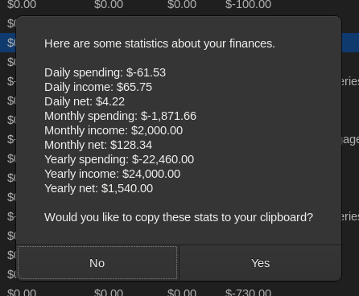

# GTK Finance Planner

Do you have monthly/semi-monthly/weekly/every 2 months/other oddly scheduled
bills? Yearly? Every 2 years? Need a way to track them all in one place?

That's what this application is for. Finance Planner allows you to enter
everything into a list and provide an estimate for what your balances will look
like every day, between any date ranges that you specify.

## Screenshots




## Installation

First, install Go - this varies based on your OS. Make sure your `$PATH`
includes `go env | grep GOBIN`.

Then, use `go install`:

```bash
CGO_ENABLED=1 go install -ldflags="-w -s -buildid= -X main.version=0.1.3" -trimpath github.com/charles-m-knox/finance-planner-gtk@latest
```

## Usage

Here's a fairly comprehensive guide on how to use this application:

1. Click `+` to add a new bill, and populate the details accordingly:
   1. The `Amount` column allows you to add a cost to a bill. All values are
      assumed negative, but if you put a `+` at the beginning, it can be
      registered as income, such as a paycheck.
   2. The `Active` column allows you to temporarily enable/disable a bill if
      you'd like to predict how a subscription will change.
   3. The `Frequency` column can be one of any three values (case-insensitive
      input): `Monthly/Yearly/Weekly`.
   4. The `Interval` column specifies how often the bill will occur. For
      example, if you selected `Monthly` for the `Frequency`, and you want it to
      occur every 2 months, then set the `Interval` value to `2`.
   5. For the Monday-Sunday checkbox columns, you can choose whether or not a
      bill can occur on a specified day of the week. For example, if you buy
      Groceries weekly on Saturdays, then just check the Saturday checkbox and
      set your `Frequency` to `Weekly`, and your `Interval` to `1`.
   6. For the `Starts` column, specify in the pattern `YYYY-MM-DD` for best
      results. This applies to the `Ends` column, too.
      1. If left at the default values (`0-0-0`) then the start and end are
         assumed to be the window for your estimation (these are the input boxes
         in the bottom right of the window).
   7. For the `Notes` column, you can put anything you want here. No special
      formatting will be applied.
2. Repeat step 1, optionally using the `Clone` button to speed things up where
   desired.
3. (optional) Enter a starting cash balance in the bottom left.
4. (optional) In the bottom center and bottom left input fields, enter a start
   date for the planner to begin, and an end date for when they will stop.
   1. If you leave these two blank, the planner will start from today and end 1
      year from today. This is just enough time to be able to get a yearly
      summary of your expenses, which you will do easily in a moment.
5. Go to the Results tab. (you can press `alt+1` and `alt+2` to switch between
   tabs quickly)
   1. You will see the planner's results!
   2. If viewing over a single year, press `ctrl+I` on your keyboard to be
      presented with a dialog that rolls up your yearly income and expenses.
      This is very useful!
6. **Save your bills to a configuration file!** To do this, you can do any of
   the following, like you'd traditionally expect:
   1. **Use the dropdown arrow in the top left of the window to see all options,
      such as save/save as/open/save results/new window/etc**.
   2. `Ctrl+Shift+S` - Save as. You'll need to do this if it's your first time
      saving to a new file.
   3. `Ctrl+S` - Save.
   4. `Ctrl+O` - Open.
   5. `Ctrl+Shift+O` - Open in a new window.
   6. `Ctrl+N` or `Ctrl+Shift+N` - Create a new config in a new window.
   7. `Ctrl+W` - Close the current window.
   8. `Ctrl+Q` - Quit the application.

## Quirks/Limitations/Bugs

There are a couple minor quirks:

* If you receive paychecks on e.g. the last day of the month, there is currently
  no direct method of doing this. I typically go with setting the `Starts`
  column to something like `2022-01-28`, since every month of the year ends on
  or after the 28th day, guaranteed.
* Sorting is currently not supported in a pleasant manner. Sorry about this - I
  want this feature too, but I struggled working with the TreeView's
  documentation.
* Some GTK theming issues, such as the icon when in the alt+tab interface or the
  application's name, have not been corrected. I'm not really sure how to do
  this with gotk, it's not documented in the example code from what I could see.
  Would like to fix this some time in the future.
* No way to sort bills, aside from editing the JSON config file itself.

## Development notes

A GTK3 desktop application written in Go, using gotk.

This application is unpolished (but the underlying library providing the finance
logic is unit tested and should work well). I do not view it as a good
representation of "ideal" code. I have not refactored or enhanced the code. I
initially wrote this application in 1 weekend. There are going to be bugs. It
still works pretty well though.

## Attributions

The app's icon is modified from Font Awesome, license here: <https://fontawesome.com/license>
